|  | Algorithm and Data Structure |
|--|--|
| NIM |  254107020063 |
| Nama |  Ahmad Raffie Athaya H. |
| Kelas | TI - 1F |
| Repository | [link] (https://github.com/RappoyAthyaa/Algoritma-StrukturData) |

# Labs #1 Programming Fundamentals Review

## 2.1.1. Selection Solution

The solution is implemented in Pemilihan1.java, and below is screenshot of the result.

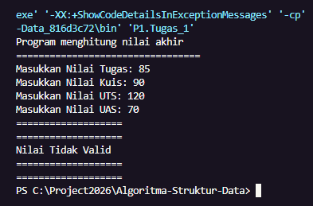
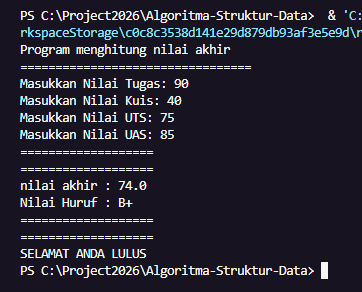

**Brief explanaton:** There are 4 main step: 
1. Input all grades
2. Validate the input
3. Calculate and convert the final grade
4. Decide the final status

## 2.1.2. Selection Solution
The solution is implemented in Pemilihan1.java, and below is screenshot of the result.

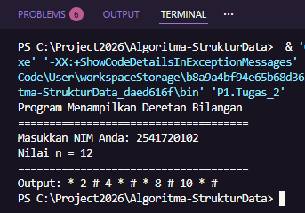
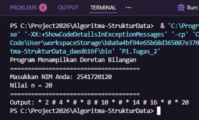

## 2.1.3. Selection Solution
The solution is implemented in Pemilihan1.java, and below is screenshot of the result.

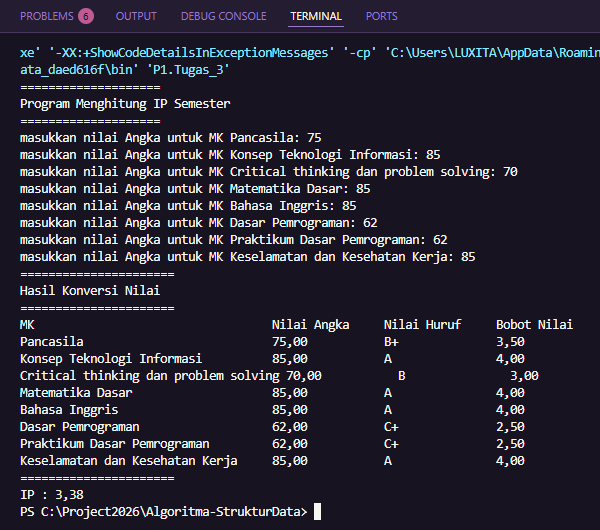

## 2.1.4. Selection Solution
The solution is implemented in Pemilihan1.java, and below is screenshot of the result.

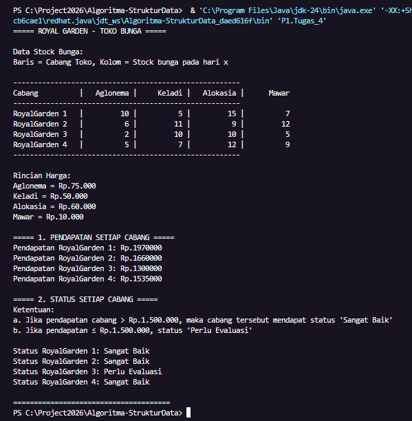

## 2.1.5. Selection Solution
The solution is implemented in Pemilihan1.java, and below is screenshot of the result.

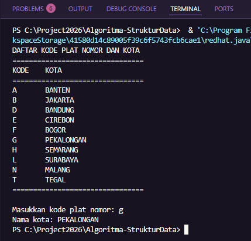
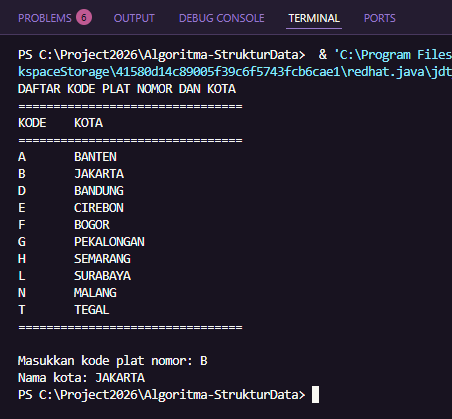

## 2.1.6. Selection Solution
The solution is implemented in Pemilihan1.java, and below is screenshot of the result.

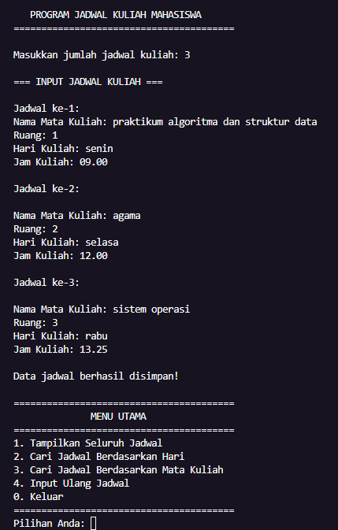
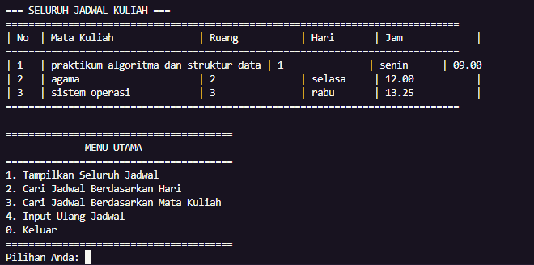
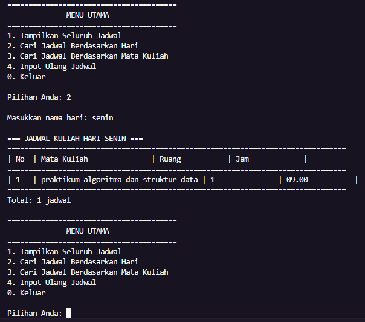
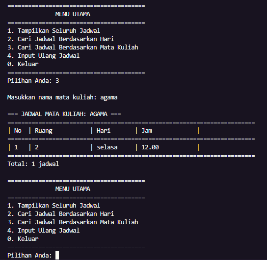
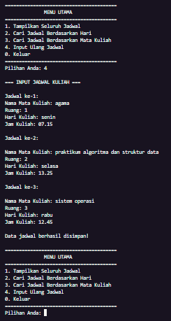
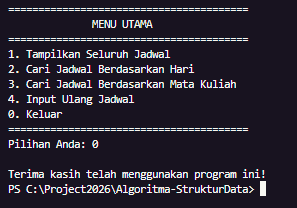