|  | Algorithm and Data Structure |
|--|--|
| NIM |  254107020063 |
| Nama |  Ahmad Raffie Athaya H. |
| Kelas | TI - 1F |
| Repository | [link] (https://github.com/RappoyAthyaa/Algoritma-StrukturData) |

# Jobsheet #2 Object

## 2.1. Percobaan 1

### 2.1.1 Langkah-langkah Percobaan
➡ Gambar kode program untuk percobaan 1

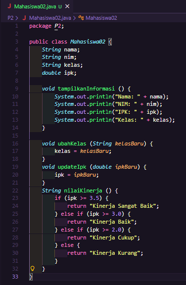

### 2.1.2 Verivikasi Hasil Percobaan
➡ Gambar hasil kode program untuk percobaan 1

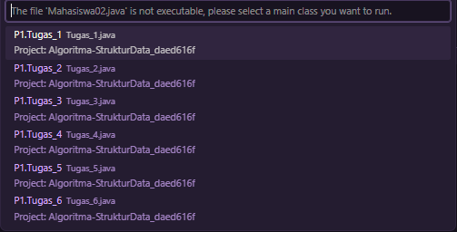

### 2.1.3 Pertanyaan

    1.Sebutkan dua karakteristik class atau object!
        : 1.Yang pertama adalah Encapsulation (Enkapsulasi) Class dalam Java dapat menyembunyikan 
            data (atribut) dan hanya mengizinkan akses melalui method tertentu. Ini dilakukan 
            menggunakan access modifier seperti private, public, dan protected.
          2.Yang kedua adalah Memiliki Atribut dan Method Setiap class memiliki atribut (variabel/
            data) dan method(fungsi/perilaku) yang 
            merepresentasikan karakteristik dan aksi dari object tersebut.

    2.Perhatikan class Mahasiswa pada Praktikum 1 tersebut, ada berapa atribut yang dimiliki oleh
      classMahasiswa? Sebutkan apa saja atributnya!
        : Ada empat atribut saja, yang terbagi menjadi dua tipe data yaitu atribut "String" dan atribut "double".

    3. Ada berapa method yang dimiliki oleh class tersebut? Sebutkan apa saja methodnya!
        : Terdapat empat method dengan method pertama yaitu tampilkanInformasi (): berdeklarasi 
          void, method kedua yaitu ubahKelas(kelasBaru: String):
          berdeklarasi void, method ketiga yaitu updateIpk(ipkBaru: double): berdeklarasi void, dan 
          yang terakhir yaitu nilaiKinerja(ipk: double): dengan berdeklarasi String.

    4. Perhatikan method updateIpk() yang terdapat di dalam class Mahasiswa. Modifikasi isi method
       tersebut sehingga IPK yang dimasukkan valid yaitu terlebih dahulu dilakukan pengecekan apakah
       IPK yang dimasukkan di dalam rentang 0.0 sampai dengan 4.0 (0.0 <= IPK <= 4.0). Jika IPK tidak 
       pada rentang tersebut maka dikeluarkan pesan: "IPK tidak valid. arus antara 0.0 dan 4.0".
        : Gambar kode program untuk pertanyaan no 4

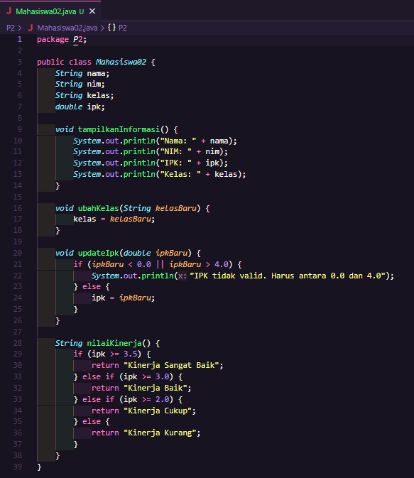

    5. Jelaskan bagaimana cara kerja method nilaiKinerja() dalam mengevaluasi kinerja mahasiswa,
       kriteria apa saja yang digunakan untuk menentukan nilai kinerja tersebut, dan apa yang
       dikembalikan (di-return-kan) oleh method nilaiKinerja() tersebut?
        : Method nilaiKinerja() bekerja dengan cara membaca nilai ipk yang sudah tersimpan, lalu 
          mengevaluasinya menggunakan serangkaian kondisi if-else if secara berurutan dari atas ke bawah. 
          Kondisi pertama yang terpenuhi akan langsung mengembalikan nilai String dan menghentikan eksekusi method.
          Apa yang Di-return? Method ini bertipe String, sehingga yang dikembalikan adalah sebuah teks/kalimat
          yang merepresentasikan kategori kinerja mahasiswa. 

## 2.2. Percobaan 2

### 2.2.1. Langkah-langkah Percobaan
➡ Gambar kode program untuk percobaan 2

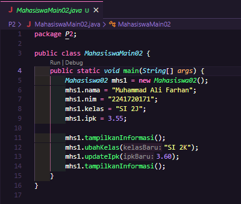

### 2.2.2 Verivikasi Hasil Percobaan
➡ Gambar hasil kode program untuk percobaan 2

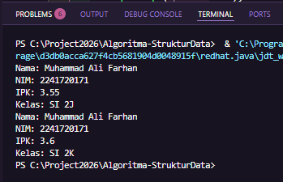

### 2.2.3 Pertanyaan

    1. Pada class MahasiswaMain, tunjukkan baris kode program yang digunakan untuk proses 
       instansiasi! Apa nama object yang dihasilkan?
        : Baris kode yang digunakan untuk proses instansiasi adalah: "Mahasiswa02 mhs1 = new Mahasiswa02();"

    2. Bagaimana cara mengakses atribut dan method dari suatu objek?
        : Cara mengakses atribut dan method dari suatu objek menggunakan operator titik (.) dengan sintaks:
          • namaObject.namaAtribut
          • namaObject.namaMethod()
          di mana keduanya dihubungkan dengan operator titik (.).

    3. Mengapa hasil output pemanggilan method tampilkanInformasi() pertama dan kedua berbeda?
        : Karena yang pertama untuk menampilkan informasi sebelum diubah, saya beri contoh
          dari "mhs1.ipk = 3.55;" ➞ dimasukan ke atribut "ipk". dan untuk yang kedua
          menampilkan informasi yang sudah diubah, contoh "ipk" ➞ dimasukan ke method
          "updateIpk" dengan atribut didalamnya "ipkBaru", setelah diinput kembali dengan
          kode "mhs1.updateIpk(3.60);" maka jika ditampilkan kembali dengan method 
          "tampilanInformasi()" akan terganti yang kita input pertama.

## 2.3 Percobaan 3

### 2.3.1. Langkah-langkah Percobaan
➡ Gambar kode program untuk percobaan 3 class "Mahasiswa02.java"

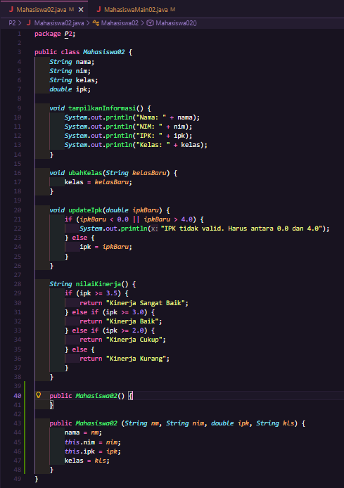

➡ Gambar kode program untuk percobaan 3 class "MahasiswaMain02.java"

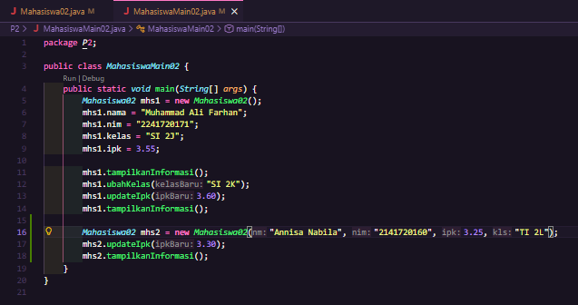

### 2.2.2 Verivikasi Hasil Percobaan
➡ Gambar hasil kode program untuk percobaan 3

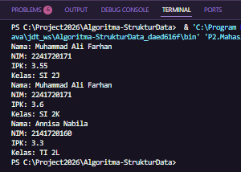

### 2.3.3 Pertanyaan

    1. Pada class Mahasiswa di Percobaan 3, tunjukkan baris kode program yang digunakan untuk 
       mendeklarasikan konstruktor berparameter!
        : Pada class Mahasiswa02, baris kode yang digunakan untuk mendeklarasikan konstruktor berparameter adalah:
          "public Mahasiswa02 (String nm, String nim, double ipk, String kls) {
          nama = nm;
          this.nim = nim;
          this.ipk = ipk;
          kelas = kls;
          }"
          Konstruktor ini menerima empat parameter yaitu nm (nama), nim, ipk, dan kls (kelas), yang kemudian 
          digunakan untuk menginisialisasi atribut-atribut objek saat objek pertama kali dibuat.

    2. Perhatikan class MahasiswaMain. Apa sebenarnya yang dilakukan pada baris program berikut? 
       "Mahasiswa02 mhs2 = new Mahasiswa02("Annisa Nabila", "2141720160", 3.25, "TI 2L");"
        : Baris program tersebut melakukan pembuatan objek baru dari claas "Mahasiswa" menggunakan konsturktor 
          berparameter.

    3. Hapus konstruktor default pada class Mahasiswa, kemudian compile dan run program. Bagaimana hasilnya? 
       Jelaskan mengapa hasilnya demikian!
        : ➡ Gambar kode program untuk percobaan pertanyaan no 3 class "Mahasiswa02.java"

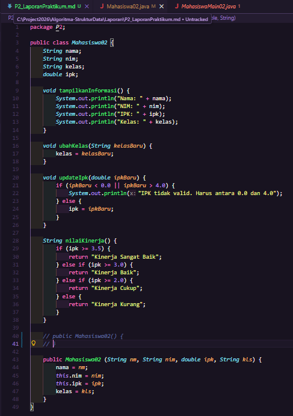

          ➡ Gambar hasil untuk percobaan pertanyaan no 3 class "Mahasiswa02.java"

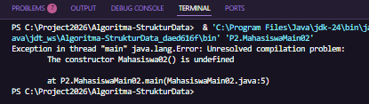

    4. Setelah melakukan instansiasi object, apakah method di dalam class Mahasiswa harus diakses 
       secara berurutan? Jelaskan alasannya!
        : Tidak, method di dalam class Mahasiswa02 tidak harus diakses secara berurutan. 
          Hal ini karena setiap method bersifat independen satu sama lain, artinya masing-masing 
          method memiliki fungsinya sendiri dan tidak bergantung pada method lain untuk dapat dijalankan.

    5. Buat object baru dengan nama mhs<NamaMahasiswa> menggunakan konstruktor berparameter 
       dari class Mahasiswa!
        :  ➡ Gambar kode program untuk percobaan pertanyaan no 5 class "MahasiswaMain02.java"

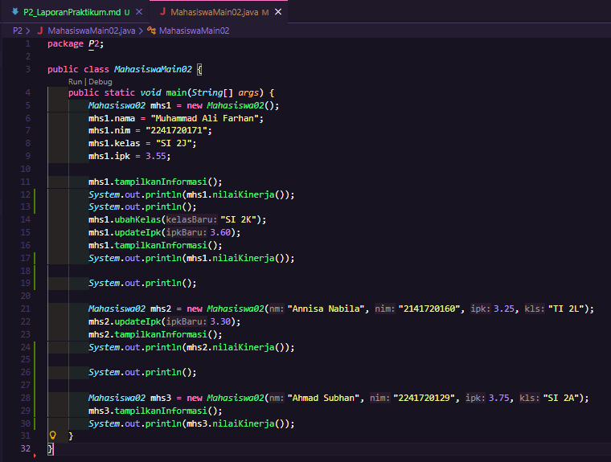

          ➡ Gambar hasil untuk percobaan pertanyaan no 5 class "MahasiswaMain02.java"

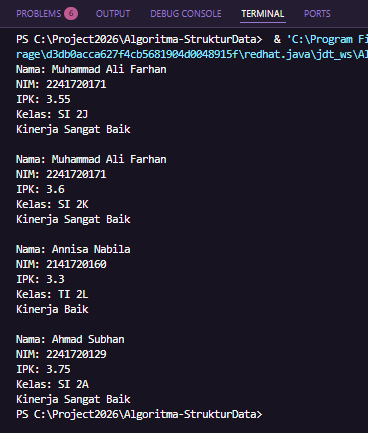

## 2.4 Latihan Praktikum

### Latihan 1
➡ Gambar kode program untuk tugas latihan 1 class "MataKuliah02.java"

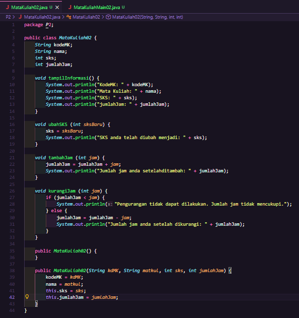

➡ Gambar kode program untuk tugas lathian 1 class "MataKuliahMain02.java"

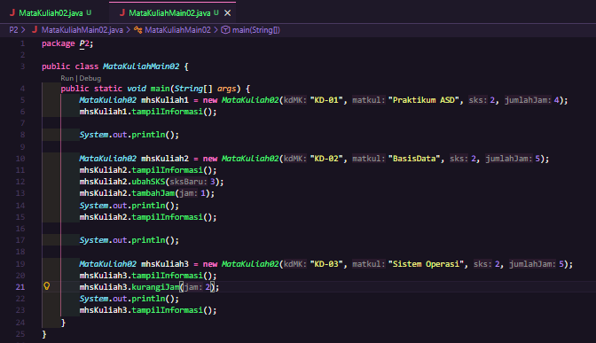

➡ Gambar hasil untuk tugas latihan 1 class "MataKuliahMain02.java"

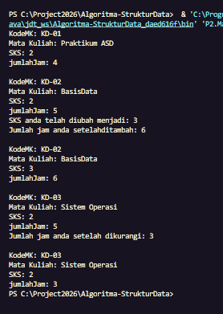

### Latihan 1
➡ Gambar kode program untuk tugas latihan 2 class "Dosen02.java"

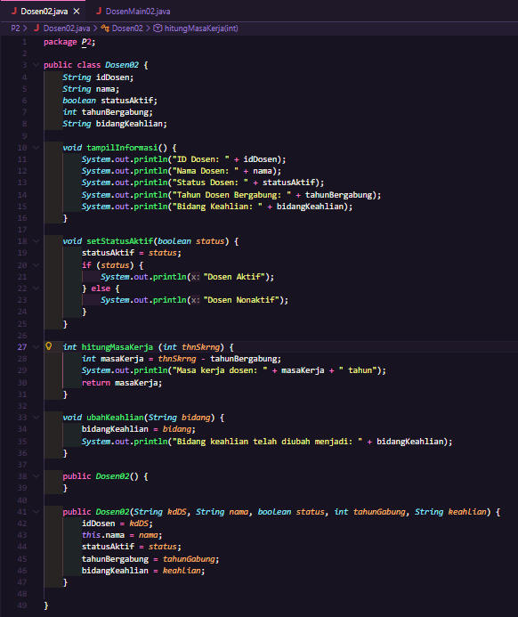

➡ Gambar kode program untuk tugas latihan 2 class "DosenMain02.java"

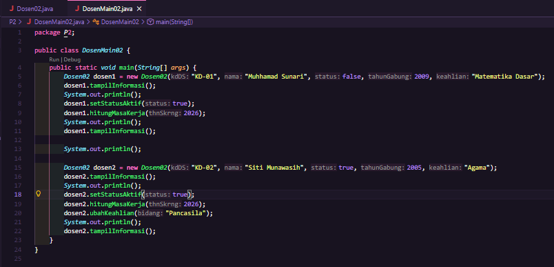

➡ Gambar hasil untuk tugas lathian 2 class "DosenMain02.java"

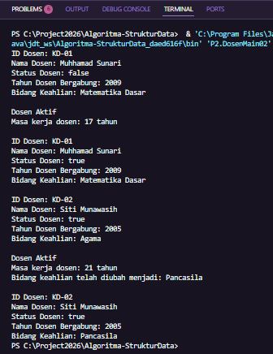